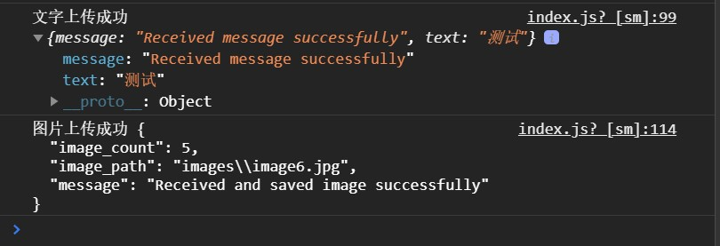

主要三个部分，

1.小程序部分

miniprogram5     

输入文字和选择图片后：

​         

reasponse:

接收文字：

接收图片：

2.服务器端程序

server.py  flask框架

 3.嗅探函数-使用python-scapy，监听服务器5000端口的所有包

scapy-1.py

嗅探的包输出在控制台：

 4.嗅探过程记录和分析

packets.txt

租用腾讯云服务器公网ip:101.35.247.220,续费到1-28，这期间小程序可以使用