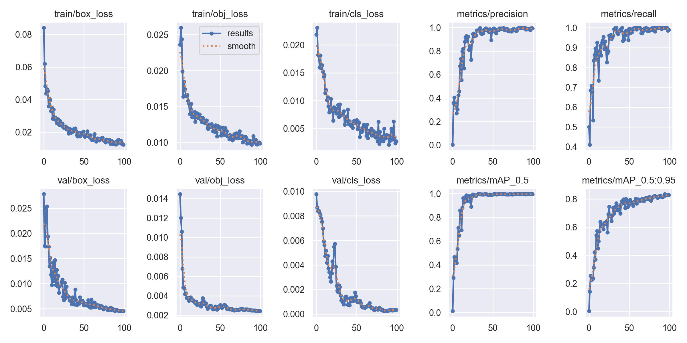
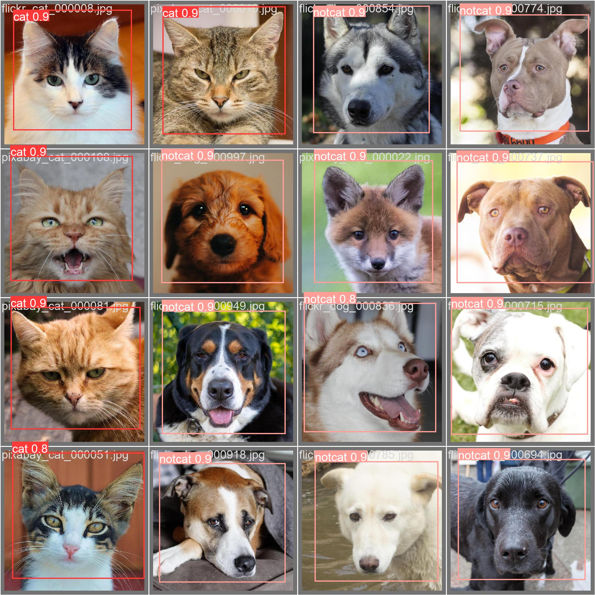
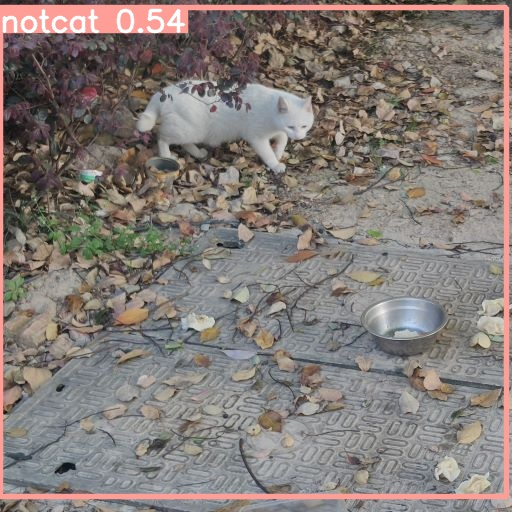
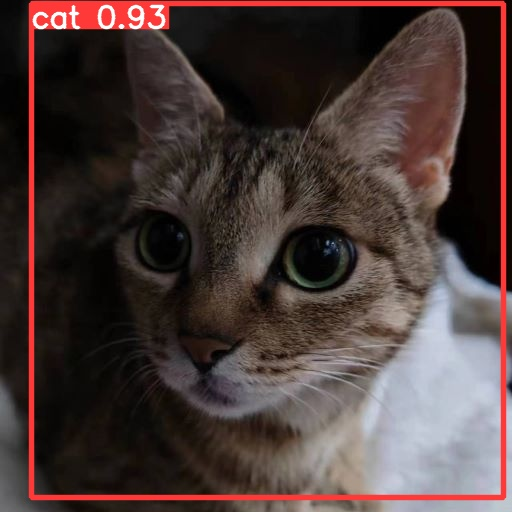

文件附带：

exp15: 这次训练的过程记录，weights里包括best.pt

exp10: 使用这次的best.pt 识别的一张正脸照和一张侧脸照

Catdata :包括 train和val，包括image和label

trainlog2:训练中的过程记录

cats.yaml:训练集，验证集路径，nc,classes

catcon.yaml:在yolov5s.yaml基础上修改的模型

detect.py，train.py:训练和识别

操作系统：windows11

IDE：pycharm

python版本：anaconda Pyhon3.9

pytorch版本：conda install pytorch torchvision torchaudio cpuonly -c pytorch

GPU:无GPU

labelimg(之前安装的）

classes:cat;notcat

数据集来源：https://www.kaggle.com/datasets/andrewmvd/animal-faces

cat 100 ,dog 100,wild 60

因为数据集比较少，所以验证集部分为数据集随机抽取1/3，训练集使用剩下的2/3

可以看到训练结果还是比较理想的:为Val_batch_pred

下面是两张照片

可以看到，正脸被识别成功为cat,而侧脸被识别为notcat,这是因为

训练集不平衡：训练集中只包含了大量的正脸照片，那么模型没有足够的样本来学习和识别侧脸。

视角变化：猫的正脸和侧脸在视角上有很大的差异。训练集中没有包含足够多的不同视角的样本，模型无法准确地识别侧脸照片。

目标尺寸问题：训练集中的猫脸在图像中的尺寸和位置与侧脸照片有较大差异，模型会难以正确识别侧脸